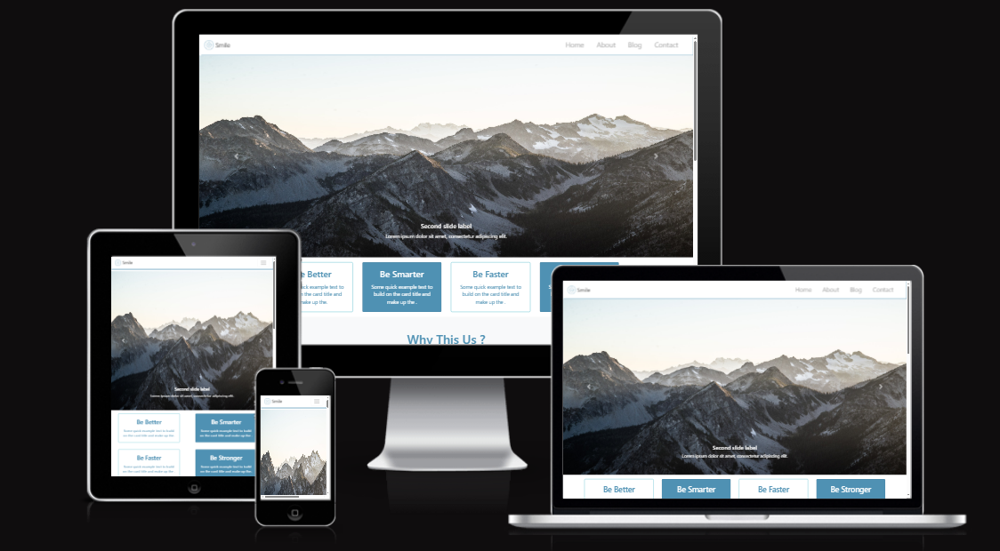

# **Smile Modern Website Design**

**Smile Modern Website Design** is a sleek, fully responsive website template designed to provide a professional, polished online presence. Whether you're building a personal portfolio, a small business site, or a product landing page, this template has everything you need to get started. Built using HTML, CSS, and JavaScript, it offers a modern, minimalistic design with an intuitive layout and smooth interactions.

## **Features**

- 🌍 **Fully Responsive**: The design adapts beautifully across all devices—desktop, tablet, or mobile—ensuring your site looks great no matter where it's viewed.
  
- 🎨 **Minimalist UI/UX**: A clean, modern aesthetic with a focus on usability. The user-friendly interface makes navigation easy and enjoyable.

- 🖼️ **Customizable Sections**: The template includes flexible sections such as an eye-catching hero section, service showcase, testimonials, and a contact form—ideal for presenting your content in a clear, engaging way.

- 👥 **About Us Section**: Introduce your team, share your mission, and tell your story with the pre-designed About Us section that builds trust and helps visitors connect with your brand.

- ✨ **Smooth Animations**: Enjoy subtle CSS animations and transitions that give the website a modern touch, improving user engagement without overloading the experience.

- 📬 **Contact Form**: A ready-to-use contact form that visitors can use to get in touch. It's customizable to suit your needs (e.g., email notifications, custom fields).

- 🔍 **SEO Optimized**: The structure of the site follows SEO best practices, helping you rank better in search engine results and making it easier for customers to find you.

## **Technologies Used**

- **HTML5**: Used for structuring the website's content.
- **CSS3**: To create a responsive, clean, and visually appealing layout.
- **JavaScript**: For interactive elements like smooth scrolling, form validation, and animations.
- **Font Awesome**: To add scalable vector icons to the website (e.g., social media icons).
- **Google Fonts**: A wide selection of fonts to enhance the look and feel of your content.

## **Installation**

To get started with the **Smile Modern Website Design**, follow these steps:

1. **Clone the repository** to your local machine:
   ```bash
   git clone https://github.com/Momen9Sarsour/Smile-Modern-Website-Design.git
   ```

2. **Navigate to the project folder**:
   ```bash
   cd Smile-Modern-Website-Design
   ```

3. **Open the `index.html` file** in your browser to view the site locally.

4. Optionally, you can deploy the site on a live server using platforms like GitHub Pages, Netlify, or Vercel for a live version.

## **Customization**

The template is designed to be easily customizable to fit your needs:

- **Content**: Modify the HTML files to update text and descriptions. Replace the default content with your own.
- **Images**: Replace placeholder images with your own high-quality visuals. (Make sure to update the image paths as necessary.)
- **Colors**: Modify the CSS to adjust the color scheme to match your branding.
- **Contact Form**: Customize the contact form action to suit your email server or backend setup.

## **Project Images**

Here are some example images showcasing the design of the template:

- 📸 **Website Screenshot**:
  

## **Live Demo**

Check out the live demo of this website design to see it in action:

[Live Demo of Smile Modern Website Design](https://example.com)

---

## **Example Usage**

Whether you're a **freelancer** building your personal portfolio, a **small business** creating an online presence, or a **startup** looking for a modern website template, **Smile Modern Website Design** offers the perfect starting point to showcase your brand with style.

---

## 👤 **About Me**

**Momen Sarsour — Computer Systems Engineering**  
📧 Email: **momensarsour5@gmail.com**  
📱 WhatsApp: **+970567077179**
